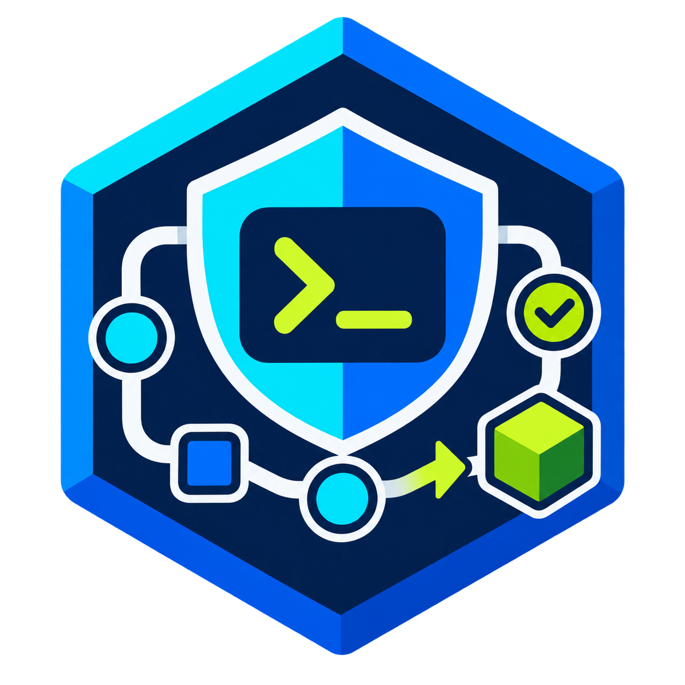

<p align="center">
  
</p>

<h1 align="center">Coding Agent Harness</h1>

<p align="center">
  <strong>Install a guarded, repeatable software-delivery workflow into your coding agent.</strong>
</p>

<p align="center">
  <a href="https://github.com/hopkienne/coding-agent-harness/blob/main/LICENSE"></a>
  
  
</p>

`@hopkienne/coding-agent-harness` turns a coding harness into a delivery partner with explicit engineering gates:

```text
Jira requirement
      ↓
Linked Google Docs (optional, read-only)
      ↓
Architecture grill with a human
      ↓
ADR + implementation spec
      ↓
Confirmed GitLab technical tickets
      ↓
TDD + Chrome DevTools verification
      ↓
Spec-aware review + confirmed merge request
```

The agent moves the process forward, but it cannot silently write GitLab issues, dependencies, labels, or merge requests. Those boundaries always require a human confirmation.

## Why this exists

Coding agents are fast at producing code. Delivery quality still depends on a precise requirement, deliberate interface decisions, test evidence, and reviewable changes. This package makes that discipline portable across harnesses instead of embedding it in a single personal prompt file.

It installs:

- an end-to-end `/delivery` entry point plus eleven focused workflow commands where the harness supports commands;
- a one-question-at-a-time architecture grill;
- durable documentation conventions for `CONTEXT.md`, `docs/adr/`, and `docs/specs/`;
- MCP wiring for Jira, GitLab, Chrome DevTools, and optional read-only Google Docs;
- project-local `.gitignore` rules for the workflow files generated by the selected harness;
- explicit approval gates before external GitLab writes and merge-request creation.

## Quick start

After the package is published to npm, run this from the project you want to configure:

```bash
npx @hopkienne/coding-agent-harness init
```

The interactive installer is a guided terminal wizard: it opens with an overview, presents keyboard menus with descriptions, masks credentials, shows an install spinner, and closes with the exact next command. Use <kbd>↑</kbd>/<kbd>↓</kbd> and <kbd>Enter</kbd>; press <kbd>Esc</kbd> or <kbd>Ctrl</kbd>+<kbd>C</kbd> to exit safely before files are changed.

```text
┌  Coding Agent Harness
│
◇  Step 1 of 5 — Choose your coding-agent harness
│  OpenCode
│
◇  Step 2 of 5 — Choose the installation scope
│  Project
│
◇  Step 3 of 5 — Choose Matt Pocock skills
│  Workflow skills (recommended)
│
◇  Step 4 of 5 — Read Google Docs linked from Jira?
│  Yes, configure read-only access
│
◇  Choose the Google OAuth client type
│  Desktop app JSON (recommended)
│  Web application (client ID + secret)
│
◇  Step 5 of 5 — Configure Jira and GitLab credentials now?
│  Yes, configure now
│
◇  Installation complete. Restart the harness terminal, then begin a delivery.
```

Then start a delivery:

```text
/delivery PROJ-123
```

`/delivery` also accepts a complete natural-language request. The adapter passes the full text to the workflow, which extracts the Jira key, optional GitLab project, communication language, and additional delivery constraints:

```text
/delivery thực hiện GG-7791 và hãy trao đổi với tôi bằng tiếng Việt
```

The agent reads the Jira issue and its remote links, loads accessible linked Google Docs when that optional integration is enabled, infers the GitLab project from the current repository's remote, begins the grill, and asks exactly one material question at a time. It advances automatically after the decision is clear.

The optional `group/project` argument is GitLab's full project namespace. For example, repository URL `https://gitlab.example.com/platform/mobile/edupath.git` has project path `platform/mobile/edupath`. Supply it only when the repository has no GitLab remote or more than one remote is ambiguous:

```text
/delivery PROJ-123 platform/mobile/edupath
```

> **When developing this repository:** run the local CLI directly. Do not use `npx @hopkienne/coding-agent-harness` from inside this source directory, because npm resolves the local project before the published executable:
>
> ```powershell
> node .\bin\coding-agent-harness.js init
> ```

## Original Matt Pocock skills

The built-in commands make the delivery workflow portable. Step 3 offers three modes:

- **Workflow skills (recommended)** copies only the 14 original skills used directly or transitively by this delivery workflow.
- **All skills** copies every currently discoverable skill from [`mattpocock/skills`](https://github.com/mattpocock/skills).
- **None** uses the built-in workflow commands without downloading third-party skills.

The installer uses the official Skills CLI with a copied installation, so the project does not depend on a temporary clone or a symlink.

For the overlapping engineering steps—`/grill-with-docs`, `/wayfinder`, `/to-spec`, `/to-tickets`, `/implement`, `/tdd`, `/code-review`, `/diagnosing-bugs`, and `/improve-codebase-architecture`—the generated workflow command treats the original `SKILL.md` as its primary procedure. The harness layer continues to enforce its non-negotiable rules: Jira is the requirement source and every GitLab write or merge request requires an explicit human confirmation.

The installer also completes the one-time repository setup normally performed by `/setup-matt-pocock-skills`: it adds the `## Agent skills` instruction block and non-destructively seeds `docs/agents/issue-tracker.md`, `docs/agents/triage-labels.md`, and `docs/agents/domain.md`. They define Jira as the requirement source, GitLab as the human-gated technical tracker, the default label vocabulary, and the `CONTEXT.md`/`docs/adr/` convention. Existing files are preserved; edit these files later if your team’s vocabulary or tracker policy changes.

For a project-scoped installation, the installer appends a managed block to `.gitignore` containing only the generated paths for the selected harness and skills mode. Existing ignore rules are preserved, and repeated installation does not duplicate entries. Git cannot ignore a file that is already tracked; if one of these paths was committed before installation, remove it from the index manually if you also want Git to stop tracking it.

The optional Skills CLI currently requires Node.js **22.20 or newer**. The base harness remains compatible with Node.js 20.12 or newer. For unattended setup, opt in explicitly:

```bash
npx @hopkienne/coding-agent-harness init --harness opencode --scope project --yes --matt-pocock-skills workflow
```

For unattended setup with Google Docs enabled, provide an OAuth Desktop credentials file and opt in explicitly. Add `--skip-google-auth` only when authentication will be completed separately:

```bash
npx @hopkienne/coding-agent-harness init --harness opencode --scope project --yes --google-docs on --google-oauth-credentials /secure/gcp-oauth.keys.json
```

Alternatively, use a Web application OAuth client. Prefer environment variables for the secret instead of placing it in shell history:

```bash
export GOOGLE_DRIVE_MCP_CLIENT_ID="<client-id>"
export GOOGLE_DRIVE_MCP_CLIENT_SECRET="<client-secret>"
npx @hopkienne/coding-agent-harness init --harness opencode --scope project --yes --google-docs on --google-oauth-mode web-client
```

## Updating and repairing an installation

Run `update` from an already configured repository to detect and upgrade every installed project-scoped harness. It refreshes managed workflow commands, MCP definitions, Pi package registration, and `.gitignore` entries while preserving secrets, unrelated commands, MCP servers, packages, and settings:

```bash
npx --yes @hopkienne/coding-agent-harness@latest update
```

Restrict the operation when needed:

```bash
npx --yes @hopkienne/coding-agent-harness@latest update --harness pi --scope project
```

Enable read-only Google Docs on an existing installation:

```bash
npx --yes @hopkienne/coding-agent-harness@latest update --google-docs on --google-oauth-credentials /secure/gcp-oauth.keys.json
```

`doctor` reports runtimes, detected harnesses, Jira authentication requirements, Google OAuth credential/token state when enabled, missing credentials, and Pi adapter registration. Add `--fix` to repair managed files and copy an existing Google OAuth client into the upstream standard user configuration location:

```bash
npx --yes @hopkienne/coding-agent-harness@latest doctor
npx --yes @hopkienne/coding-agent-harness@latest doctor --fix
```

Neither command reinstalls third-party Matt Pocock skills or prints token values. Normal updates and repairs leave OAuth tokens untouched; an explicit `update --google-docs on` may launch the browser consent flow, after which the MCP server stores its token in the user's configuration directory. After repairing Pi, restart or reload Pi and reconnect the relevant MCP servers.

## Harness support

| Harness | Workflow entry point | MCP output | Install scope |
| --- | --- | --- | --- |
| **Pi** | `.pi/prompts/delivery.md` → `/delivery` with full-request `$@` expansion | Registers `npm:pi-mcp-adapter@2.23.0` and writes `.pi/mcp.json` | Project or global |
| **Claude Code** | `.claude/commands/delivery.md` → `/delivery` with `$ARGUMENTS` | `.mcp.json` | Project or global |
| **OpenCode** | `opencode.json` → `/delivery` | Native local MCP entries in `opencode.json` | Project or global |
| **Codex** | `AGENTS.md` + natural-language `docs/agent-workflow/delivery.md` instruction | Optional Google Docs entry in project/global `.codex/config.toml`; other MCP config is preserved | Project or global |

For Codex, project installations write only a marked Google Docs MCP block to `.codex/config.toml`, which Codex loads for trusted projects. The block uses an allowlist containing only authentication status, metadata, and document-reading tools. Existing Codex settings and unrelated MCP servers are preserved. See the [official Codex MCP configuration documentation](https://developers.openai.com/codex/mcp).

## Workflow commands

`/delivery` is the guided end-to-end route. It accepts both `/delivery PROJ-123 [group/project]` and a natural-language request containing a Jira key. The installer also adds focused commands so developers can enter or resume a specific phase without re-running the entire workflow.

| Command | Purpose |
| --- | --- |
| `/grill-with-docs <JIRA-KEY>` | Resolve ambiguity and record context/ADRs. |
| `/wayfinder <area>` | Map a large or unfamiliar initiative into small investigations. |
| `/to-spec <JIRA-KEY>` | Produce a traced implementation spec. |
| `/to-tickets <JIRA-KEY> <project>` | Propose, then create approved GitLab tickets. |
| `/implement <issue>` | Implement one approved ticket. |
| `/tdd [scope]` | Enforce RED → GREEN → REFACTOR. |
| `/verify-ui <URL-or-flow>` | Verify UI criteria through Chrome DevTools MCP. |
| `/code-review [scope]` | Review a diff against specs and architecture. |
| `/create-mr <branch> [target]` | Preview, confirm, and create a GitLab MR. |
| `/diagnosing-bugs <symptom>` | Reproduce, narrow, fix, and verify bugs. |
| `/improve-codebase-architecture [area]` | Plan incremental architecture improvements. |

## What `/delivery` does

| Phase | Agent responsibility | Human control point |
| --- | --- | --- |
| 1. Discover | Reads Jira fields and remote links, optional linked Google Docs, code, contracts, ADRs, and current specs. | Supply missing access or resolve conflicting sources. |
| 2. Grill | Resolves material ambiguity with one focused question at a time. | Answer product and architecture decisions. |
| 3. Specify | Updates durable context, ADRs, and `docs/specs/<JIRA-KEY>.md`. | Review decisions when needed. |
| 4. Plan | Breaks the spec into small GitLab tickets and dependencies. | Confirm before any GitLab write. |
| 5. Build | Works ticket-by-ticket using RED → GREEN → refactor; verifies UI via Chrome DevTools where relevant. | Review implementation evidence. |
| 6. Review | Checks the complete diff against the spec and prepares an MR. | Confirm before MR creation. |

## MCP integrations

The installer registers the following local MCP servers where the target harness supports them:

| System | Package | Purpose |
| --- | --- | --- |
| Jira | `mcp-atlassian@0.23.0` via `uvx` | Read stories, acceptance criteria, and business rules. |
| Google Docs (optional) | `@piotr-agier/google-drive-mcp@2.5.0` via `npx` | Read Google Docs linked from Jira using Drive/Docs read-only OAuth scopes. |
| GitLab | `@zereight/mcp-gitlab` via `npx` | Create technical issues, dependency links, and merge requests after confirmation. |
| Browser | `chrome-devtools-mcp` via `npx` | Exercise UI acceptance flows, check console/network errors, and capture evidence. |

Existing MCP entries are preserved when configuration files are merged.

Pi does not load `.pi/mcp.json` natively. For Pi installations, the harness also adds `npm:pi-mcp-adapter@2.23.0` to the applicable `.pi/settings.json`; Pi installs and loads that package on restart. The adapter deliberately exposes one lazy `mcp` proxy tool instead of adding every remote tool to the model context. Workflow prompts discover Jira with `mcp({ server: "jira" })` or MCP search, then invoke the returned tool through the same proxy.

### Linked Google Docs

Google Docs integration is opt-in because every user or organization must supply its own Google OAuth application. The wizard supports two input modes:

- **Desktop app JSON (recommended):** download the credentials JSON from Google Cloud. Loopback redirects work automatically.
- **Web application:** enter `client_id` and `client_secret`. The installer materializes the upstream-required JSON outside the repository. Register all five callback URLs shown by the wizard in the Web client's **Authorized redirect URIs**.

The upstream local stdio flow always loads `~/.config/google-drive-mcp/gcp-oauth.keys.json`; it does not directly consume a bare client ID/secret pair. Coding Agent Harness bridges that limitation by creating the file for Web-client input. The default callback range is `http://127.0.0.1:3000/oauth2callback` through port `3004`; change the starting port with `--google-auth-port`. The installer restricts file permissions where supported and opens the OAuth flow. Neither credentials nor tokens are written to the repository; tokens remain at `~/.config/google-drive-mcp/tokens.json` unless explicitly overridden.

The local stdio OAuth mode used by Pi, OpenCode, Claude Code, and Codex cannot consume `GOOGLE_DRIVE_MCP_CLIENT_ID` plus `GOOGLE_DRIVE_MCP_CLIENT_SECRET` directly. Coding Agent Harness accepts that pair as installer input, writes the small compatibility JSON expected by the upstream package, and then runs the same refreshable local OAuth flow for every harness.

The generated server requests exactly these scopes:

```text
https://www.googleapis.com/auth/drive.readonly
https://www.googleapis.com/auth/documents.readonly
```

During discovery, the workflow requests Jira custom fields and remote links, extracts IDs from `docs.google.com/document/d/<DOCUMENT_ID>` URLs, and uses paginated reading for large documents. Linked documents are treated as untrusted evidence—not agent instructions. Jira acceptance criteria remain authoritative; conflicts and inaccessible documents are surfaced to the human. See the [`google-drive-mcp` setup guide](https://github.com/piotr-agier/google-drive-mcp/blob/master/docs/setup.md) for the Google Cloud prerequisites.

## Secrets and environment variables

Repository configuration may contain the non-secret Jira and GitLab endpoint URLs, but never API tokens. Tokens remain environment-variable references. Configure these values in your user environment or secret manager:

```text
JIRA_URL
JIRA_USERNAME
JIRA_API_TOKEN
JIRA_PERSONAL_TOKEN
GITLAB_API_URL
GITLAB_PERSONAL_ACCESS_TOKEN
GOOGLE_DRIVE_OAUTH_CREDENTIALS (optional override; installer targets the standard user config path)
GOOGLE_DRIVE_MCP_TOKEN_PATH (optional override)
GOOGLE_DRIVE_MCP_CLIENT_ID (Web-client installer input)
GOOGLE_DRIVE_MCP_CLIENT_SECRET (Web-client installer input)
GOOGLE_DRIVE_MCP_AUTH_PORT (optional callback range start; default 3000)
```

On Windows, the interactive installer can save supplied values as user-level environment variables. Select **Atlassian Cloud** to use `JIRA_USERNAME` + `JIRA_API_TOKEN`, or **Server / Data Center** to use `JIRA_PERSONAL_TOKEN`; the wizard defaults from the Jira hostname but lets you override it. The GitLab value is normalized to the required API endpoint format, for example `https://gitlab.example.com/api/v4`. Restart the terminal or harness after installation so it receives the updated values. For CI and macOS/Linux, inject the values through your platform's normal secret-management mechanism.

## Commands

```bash
# Interactive setup
npx @hopkienne/coding-agent-harness init

# Preview every file change without writing
npx @hopkienne/coding-agent-harness init --harness opencode --scope project --yes --dry-run

# Install every Matt Pocock skill instead of the curated workflow set
npx @hopkienne/coding-agent-harness init --harness opencode --scope project --yes --matt-pocock-skills all

# Enable linked Google Docs with read-only OAuth
npx @hopkienne/coding-agent-harness update --google-docs on --google-oauth-credentials /secure/gcp-oauth.keys.json

# Or configure a Web OAuth client interactively
npx @hopkienne/coding-agent-harness update --google-docs on --google-oauth-mode web-client

# Remove generated commands and workflow instructions (keeps MCP, credentials, and skills)
npx @hopkienne/coding-agent-harness uninstall --harness opencode --scope project --yes

# Show runtime prerequisites
npx @hopkienne/coding-agent-harness doctor
```

`--yes` is for non-interactive usage; provide the required environment variables before running it.

`uninstall` is deliberately conservative: it removes generated command files, native OpenCode workflow commands, and the guarded workflow instruction block. It preserves MCP configuration, user environment variables, `docs/agents/`, and third-party skills such as `mattpocock/skills`.

## Development

```bash
git clone https://github.com/hopkienne/coding-agent-harness.git
cd coding-agent-harness
npm test
node ./bin/coding-agent-harness.js init --harness opencode --scope project --dry-run
```

The test suite covers adapter plans, non-destructive JSON/TOML MCP merges, read-only Google Docs configuration, idempotent instruction blocks, and project-install/update/doctor integration flows.

```text
.
├── assets/       # README identity assets
├── bin/          # npm executable entry point
├── src/          # CLI, workflow definition, and harness adapters
└── test/         # Node.js test suite
```

## Automatic publishing from GitHub Actions

Every push to `main` runs [`.github/workflows/publish.yml`](./.github/workflows/publish.yml). After tests and the package-content check pass, `semantic-release` derives the next semantic version from Conventional Commit messages, updates `package.json` and `package-lock.json`, creates a Git tag and GitHub Release, then publishes to npm.

Create a repository secret named `NPM_TOKEN`. It must be an npm granular access token with **read and write** access to `@hopkienne/coding-agent-harness`; when npm 2FA is enabled, also enable **Bypass 2FA** for this CI token. Paste only the token value—without quotes, whitespace, or a line break. Never put the token in the repository or a workflow file.

| Commit format | Automatic result |
| --- | --- |
| `fix: repair installer validation` or `perf: ...` | Patch release (`0.1.0` → `0.1.1`) |
| `feat: add Claude Code adapter` | Minor release (`0.1.0` → `0.2.0`) |
| `feat!: replace the config schema` or a `BREAKING CHANGE:` footer | Major release (`0.1.0` → `1.0.0`) |
| `docs: ...`, `test: ...`, `ci: ...`, `chore: ...` | No npm release |

For example, once this automation is merged, a commit such as the following on `main` publishes `0.1.1` automatically:

```bash
git commit -m "fix: preserve existing OpenCode command settings"
git push origin main
```

The generated `chore(release)` commit is marked `[skip ci]`, so it records the new version without causing a second workflow run.

## License

[MIT](./LICENSE) © HopKienne
